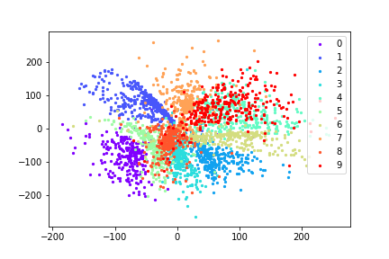

#Adversarial Autoencoder
Implement [Adversarial Autoencoder](https://arxiv.org/pdf/1511.05644.pdf), you can see more detial in the paper
## Setting
- Tensorflow 0.11
- MNIST Dataset
- Run `main.py` to train model

## Result
- z_dim = 50
- Test on 5000 examples of MNIST Test Dataset

