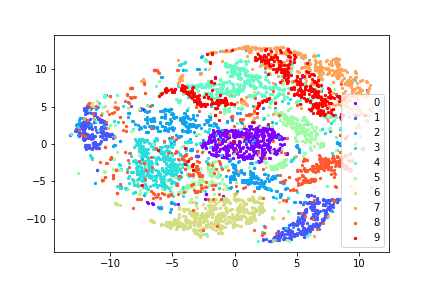

# Adversarial Autoencoder
Implement [Adversarial Autoencoder](https://arxiv.org/pdf/1511.05644.pdf), you can see more detial in the paper
## Setting
- Tensorflow 1.1
- MNIST Dataset
- Run `main.py` to train model

## Result
- z_dim = 2
- Test on 3000 MNIST test datas

- z_dim = 100
- Test on 3000 MNIST test datas (Using t-SNE transform to 2-dim)

